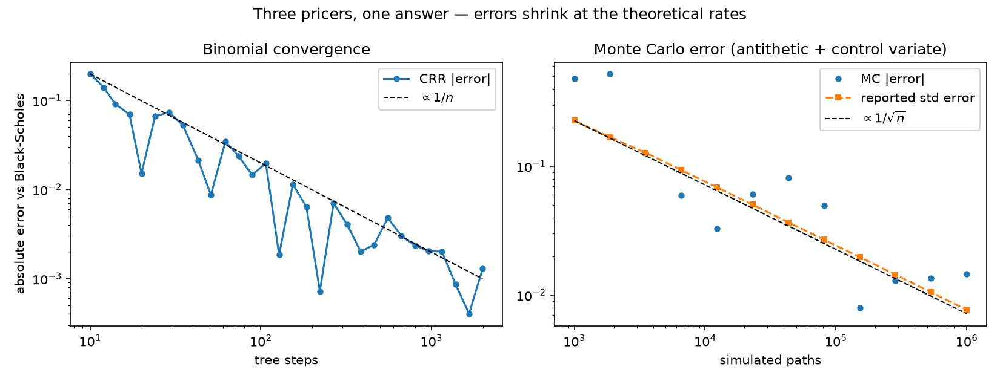

# optpricer


**Option pricing three independent ways — analytic Black-Scholes-Merton, CRR
binomial trees, and variance-reduced Monte Carlo — with a test suite where
each method must validate the others.**



A pricing library is easy to get subtly wrong and hard to eyeball. The
defense here is redundancy with teeth:

- **Cross-agreement:** analytic, tree (2,000 steps), and Monte Carlo
  (400k paths) prices of the same contract must coincide within tight,
  statistically honest tolerances.
- **Convergence rates, not just closeness:** CRR error must fall like
  O(1/n); quadrupling steps must cut the error ~4×. The MC error bar must
  shrink like 1/√n *and* contain the true price at 3σ — an honest-standard-
  error test.
- **Textbook anchors:** Hull's S=42/K=40 example (call 4.76, put 0.81) and
  the standard ATM benchmark (10.4506).
- **No-arbitrage identities:** put-call parity to 1e-12 (with dividend
  yield), American ≥ European, Merton's no-early-exercise theorem for calls
  on non-dividend stock, price bounds enforced before implied-vol inversion.
- **Greeks:** every closed-form Greek (Δ, Γ, vega, θ, ρ) is checked against
  central finite differences of the price.
- **Variance reduction that provably works:** the control variate must cut
  the reported standard error by at least 2×.

## Install & use

```bash
pip install -e ".[dev]"
```

```python
from optpricer import bs_greeks, crr_price, implied_vol, mc_price

quote = bs_greeks(105, 100, rate=0.05, vol=0.3, tau=0.8, kind="call")
american = crr_price(80, 100, 0.08, 0.2, 1.0, kind="put", style="american")
mc = mc_price(100, 95, 0.04, 0.3, 0.5, n_paths=200_000, seed=42)
vol = implied_vol(10.45, 100, 100, 0.05, 1.0)   # -> 0.20
```

## What's inside

| module | contents |
|---|---|
| `black_scholes.py` | BSM prices + closed-form Greeks, continuous dividend yield |
| `binomial.py` | vectorized CRR backward induction, European & American, degenerate-probability guard |
| `montecarlo.py` | GBM terminal simulation, antithetic variates, terminal-spot control variate, honest SE |
| `implied.py` | Newton-with-bisection implied vol, no-arbitrage band rejection |

## Tests

```bash
pytest -q      # 34 tests
ruff check .
```

## License

MIT
